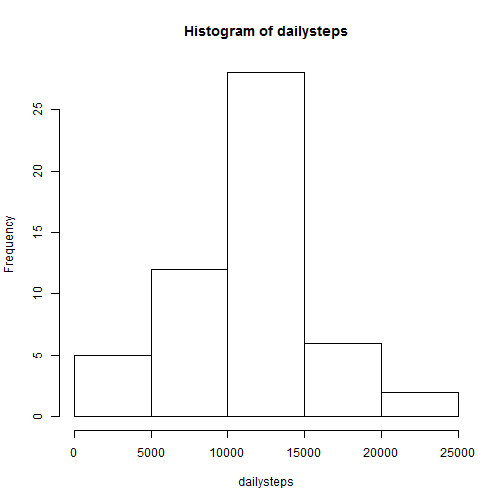
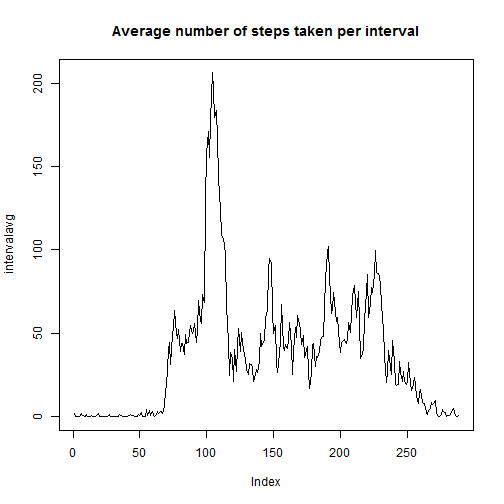
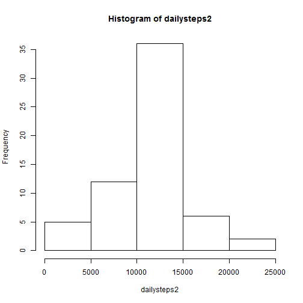

# Reproducible Research: Peer Assessment 1

## Loading and preprocessing the data

```r
data <- read.csv("activity.csv")
```

## What is mean total number of steps taken per day?


```r
dailysteps <- tapply(data$steps, data$date, sum)
dailysteps
```

```
## 2012-10-01 2012-10-02 2012-10-03 2012-10-04 2012-10-05 2012-10-06 
##         NA        126      11352      12116      13294      15420 
## 2012-10-07 2012-10-08 2012-10-09 2012-10-10 2012-10-11 2012-10-12 
##      11015         NA      12811       9900      10304      17382 
## 2012-10-13 2012-10-14 2012-10-15 2012-10-16 2012-10-17 2012-10-18 
##      12426      15098      10139      15084      13452      10056 
## 2012-10-19 2012-10-20 2012-10-21 2012-10-22 2012-10-23 2012-10-24 
##      11829      10395       8821      13460       8918       8355 
## 2012-10-25 2012-10-26 2012-10-27 2012-10-28 2012-10-29 2012-10-30 
##       2492       6778      10119      11458       5018       9819 
## 2012-10-31 2012-11-01 2012-11-02 2012-11-03 2012-11-04 2012-11-05 
##      15414         NA      10600      10571         NA      10439 
## 2012-11-06 2012-11-07 2012-11-08 2012-11-09 2012-11-10 2012-11-11 
##       8334      12883       3219         NA         NA      12608 
## 2012-11-12 2012-11-13 2012-11-14 2012-11-15 2012-11-16 2012-11-17 
##      10765       7336         NA         41       5441      14339 
## 2012-11-18 2012-11-19 2012-11-20 2012-11-21 2012-11-22 2012-11-23 
##      15110       8841       4472      12787      20427      21194 
## 2012-11-24 2012-11-25 2012-11-26 2012-11-27 2012-11-28 2012-11-29 
##      14478      11834      11162      13646      10183       7047 
## 2012-11-30 
##         NA
```


For this part of the assignment, you can ignore the missing values in the dataset.

Make a histogram of the total number of steps taken each day

```r
hist(dailysteps)
```

 

Calculate and report the mean and median total number of steps taken per day

```r
dailymean <- mean(dailysteps, na.rm=TRUE)
dailymean
```

```
## [1] 10766
```

```r
dailymedian <- median(dailysteps, na.rm=TRUE)
dailymedian
```

```
## [1] 10765
```

## What is the average daily activity pattern?

Make a time series plot (i.e. type = "l") of the 5-minute interval (x-axis) and the average number of steps taken, averaged across all days (y-axis)


```r
intervalavg <- tapply(data$steps, data$interval, mean, na.rm=TRUE)
plot(intervalavg, type= "l", main="Average number of steps taken per interval")
```

 

Which 5-minute interval, on average across all the days in the dataset, contains the maximum number of steps?


```r
max(intervalavg)
```

```
## [1] 206.2
```

```r
intervalavg
```

```
##         0         5        10        15        20        25        30 
##   1.71698   0.33962   0.13208   0.15094   0.07547   2.09434   0.52830 
##        35        40        45        50        55       100       105 
##   0.86792   0.00000   1.47170   0.30189   0.13208   0.32075   0.67925 
##       110       115       120       125       130       135       140 
##   0.15094   0.33962   0.00000   1.11321   1.83019   0.16981   0.16981 
##       145       150       155       200       205       210       215 
##   0.37736   0.26415   0.00000   0.00000   0.00000   1.13208   0.00000 
##       220       225       230       235       240       245       250 
##   0.00000   0.13208   0.00000   0.22642   0.00000   0.00000   1.54717 
##       255       300       305       310       315       320       325 
##   0.94340   0.00000   0.00000   0.00000   0.00000   0.20755   0.62264 
##       330       335       340       345       350       355       400 
##   1.62264   0.58491   0.49057   0.07547   0.00000   0.00000   1.18868 
##       405       410       415       420       425       430       435 
##   0.94340   2.56604   0.00000   0.33962   0.35849   4.11321   0.66038 
##       440       445       450       455       500       505       510 
##   3.49057   0.83019   3.11321   1.11321   0.00000   1.56604   3.00000 
##       515       520       525       530       535       540       545 
##   2.24528   3.32075   2.96226   2.09434   6.05660  16.01887  18.33962 
##       550       555       600       605       610       615       620 
##  39.45283  44.49057  31.49057  49.26415  53.77358  63.45283  49.96226 
##       625       630       635       640       645       650       655 
##  47.07547  52.15094  39.33962  44.01887  44.16981  37.35849  49.03774 
##       700       705       710       715       720       725       730 
##  43.81132  44.37736  50.50943  54.50943  49.92453  50.98113  55.67925 
##       735       740       745       750       755       800       805 
##  44.32075  52.26415  69.54717  57.84906  56.15094  73.37736  68.20755 
##       810       815       820       825       830       835       840 
## 129.43396 157.52830 171.15094 155.39623 177.30189 206.16981 195.92453 
##       845       850       855       900       905       910       915 
## 179.56604 183.39623 167.01887 143.45283 124.03774 109.11321 108.11321 
##       920       925       930       935       940       945       950 
## 103.71698  95.96226  66.20755  45.22642  24.79245  38.75472  34.98113 
##       955      1000      1005      1010      1015      1020      1025 
##  21.05660  40.56604  26.98113  42.41509  52.66038  38.92453  50.79245 
##      1030      1035      1040      1045      1050      1055      1100 
##  44.28302  37.41509  34.69811  28.33962  25.09434  31.94340  31.35849 
##      1105      1110      1115      1120      1125      1130      1135 
##  29.67925  21.32075  25.54717  28.37736  26.47170  33.43396  49.98113 
##      1140      1145      1150      1155      1200      1205      1210 
##  42.03774  44.60377  46.03774  59.18868  63.86792  87.69811  94.84906 
##      1215      1220      1225      1230      1235      1240      1245 
##  92.77358  63.39623  50.16981  54.47170  32.41509  26.52830  37.73585 
##      1250      1255      1300      1305      1310      1315      1320 
##  45.05660  67.28302  42.33962  39.88679  43.26415  40.98113  46.24528 
##      1325      1330      1335      1340      1345      1350      1355 
##  56.43396  42.75472  25.13208  39.96226  53.54717  47.32075  60.81132 
##      1400      1405      1410      1415      1420      1425      1430 
##  55.75472  51.96226  43.58491  48.69811  35.47170  37.54717  41.84906 
##      1435      1440      1445      1450      1455      1500      1505 
##  27.50943  17.11321  26.07547  43.62264  43.77358  30.01887  36.07547 
##      1510      1515      1520      1525      1530      1535      1540 
##  35.49057  38.84906  45.96226  47.75472  48.13208  65.32075  82.90566 
##      1545      1550      1555      1600      1605      1610      1615 
##  98.66038 102.11321  83.96226  62.13208  64.13208  74.54717  63.16981 
##      1620      1625      1630      1635      1640      1645      1650 
##  56.90566  59.77358  43.86792  38.56604  44.66038  45.45283  46.20755 
##      1655      1700      1705      1710      1715      1720      1725 
##  43.67925  46.62264  56.30189  50.71698  61.22642  72.71698  78.94340 
##      1730      1735      1740      1745      1750      1755      1800 
##  68.94340  59.66038  75.09434  56.50943  34.77358  37.45283  40.67925 
##      1805      1810      1815      1820      1825      1830      1835 
##  58.01887  74.69811  85.32075  59.26415  67.77358  77.69811  74.24528 
##      1840      1845      1850      1855      1900      1905      1910 
##  85.33962  99.45283  86.58491  85.60377  84.86792  77.83019  58.03774 
##      1915      1920      1925      1930      1935      1940      1945 
##  53.35849  36.32075  20.71698  27.39623  40.01887  30.20755  25.54717 
##      1950      1955      2000      2005      2010      2015      2020 
##  45.66038  33.52830  19.62264  19.01887  19.33962  33.33962  26.81132 
##      2025      2030      2035      2040      2045      2050      2055 
##  21.16981  27.30189  21.33962  19.54717  21.32075  32.30189  20.15094 
##      2100      2105      2110      2115      2120      2125      2130 
##  15.94340  17.22642  23.45283  19.24528  12.45283   8.01887  14.66038 
##      2135      2140      2145      2150      2155      2200      2205 
##  16.30189   8.67925   7.79245   8.13208   2.62264   1.45283   3.67925 
##      2210      2215      2220      2225      2230      2235      2240 
##   4.81132   8.50943   7.07547   8.69811   9.75472   2.20755   0.32075 
##      2245      2250      2255      2300      2305      2310      2315 
##   0.11321   1.60377   4.60377   3.30189   2.84906   0.00000   0.83019 
##      2320      2325      2330      2335      2340      2345      2350 
##   0.96226   1.58491   2.60377   4.69811   3.30189   0.64151   0.22642 
##      2355 
##   1.07547
```
We can see from the list above, that the max average number of steps (206,2) is contained by interval "835", which is 8:35-8:40 AM.


## Imputing missing values

Note that there are a number of days/intervals where there are missing values (coded as NA). The presence of missing days may introduce bias into some calculations or summaries of the data.

Calculate and report the total number of missing values in the dataset (i.e. the total number of rows with NAs)

```r
NArows <- sum(is.na(data[,1]))
NArows
```

```
## [1] 2304
```

Devise a strategy for filling in all of the missing values in the dataset. The strategy does not need to be sophisticated. For example, you could use the mean/median for that day, or the mean for that 5-minute interval, etc.

Create a new dataset that is equal to the original dataset but with the missing data filled in.

Coding strategy: Since each day has 288 intervals, NA-values are filled with the value "dailymean/288" 

```r
for (i in 1:nrow(data)){
    if (is.na(data[i,1])) {
       data[i,1] = dailymean/288 # 288 is the number of #intervals per day
    }
}
```

Make a histogram of the total number of steps taken each day and Calculate and report the mean and median total number of steps taken per day. Do these values differ from the estimates from the first part of the assignment? What is the impact of imputing missing data on the estimates of the total daily number of steps?


```r
dailysteps2 <- tapply(data$steps, data$date, sum)
dailysteps2
```

```
## 2012-10-01 2012-10-02 2012-10-03 2012-10-04 2012-10-05 2012-10-06 
##      10766        126      11352      12116      13294      15420 
## 2012-10-07 2012-10-08 2012-10-09 2012-10-10 2012-10-11 2012-10-12 
##      11015      10766      12811       9900      10304      17382 
## 2012-10-13 2012-10-14 2012-10-15 2012-10-16 2012-10-17 2012-10-18 
##      12426      15098      10139      15084      13452      10056 
## 2012-10-19 2012-10-20 2012-10-21 2012-10-22 2012-10-23 2012-10-24 
##      11829      10395       8821      13460       8918       8355 
## 2012-10-25 2012-10-26 2012-10-27 2012-10-28 2012-10-29 2012-10-30 
##       2492       6778      10119      11458       5018       9819 
## 2012-10-31 2012-11-01 2012-11-02 2012-11-03 2012-11-04 2012-11-05 
##      15414      10766      10600      10571      10766      10439 
## 2012-11-06 2012-11-07 2012-11-08 2012-11-09 2012-11-10 2012-11-11 
##       8334      12883       3219      10766      10766      12608 
## 2012-11-12 2012-11-13 2012-11-14 2012-11-15 2012-11-16 2012-11-17 
##      10765       7336      10766         41       5441      14339 
## 2012-11-18 2012-11-19 2012-11-20 2012-11-21 2012-11-22 2012-11-23 
##      15110       8841       4472      12787      20427      21194 
## 2012-11-24 2012-11-25 2012-11-26 2012-11-27 2012-11-28 2012-11-29 
##      14478      11834      11162      13646      10183       7047 
## 2012-11-30 
##      10766
```

```r
mean(dailysteps2)
```

```
## [1] 10766
```

```r
median(dailysteps2)
```

```
## [1] 10766
```

```r
hist(dailysteps2)
```

 

